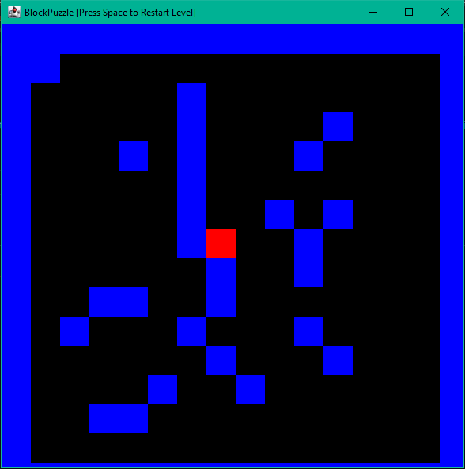

# BlockPuzzle
A simple block-based simulation I guess? It lets you move around Blocks with an algorithm that uses
Recursion. 

GitHub doesn't let you embed Local Videos in Markdown right now, so you'll have to download
demo.mp4 to check it out fully. But here's a nice screenshot instead.

